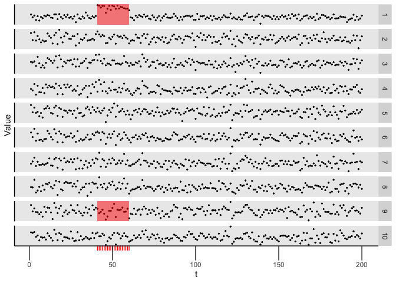

<!-- README.md is generated from README.Rmd. Please edit that file -->

# capacc

An `R` package for detecting (collective and point) anomalies (CAPA-CC)
or changepoints (CPT-CC) in cross-correlated data. It also contains code
to reproduce the simulation study in Tveten, Eckley, Fearnhead (2020)
“Scalable changepoint and anaomly detection in cross-correlated data
with an application to condition monitoring”.

## Overview

Functionality:

  - Function for running the CAPA-CC algorithm on data, as well as
    CPT-CC for a single change, implemented in C++.
  - Functions for visualising the detected collective and point
    anomalies.
  - Functions for estimating a precision matrix restricted to a given
    adjacency matrix by the GLASSO method.
  - Functions for generating test data and running the simulation study
    in “Scalable changepoint and anaomly detection in cross-correlated
    data with an application to condition monitoring”.

## Installation

You can install capacc from github with:

``` r
# install.packages("devtools")
devtools::install_github("Tveten/capacc")
```

## Exported and documented functions

For more information, see the documentation of the functions below
inside R.

  - capa.cc
  - cpt.cc
  - robust\_sparse\_precision
  - plot.capacc
  - simulate\_cor
  - car\_precision\_mat

The following functions rerun the simulation study:

  - all\_known\_power\_runs10
  - all\_known\_power\_runs100
  - all\_known\_cpt\_runs10
  - all\_known\_cpt\_runs100
  - all\_cpt\_est\_runs
  - all\_multiple\_anom\_runs10
  - all\_multiple\_anom\_runs100
  - all\_subset\_est\_runs

## Example

``` r
library(capacc)

p <- 10
Sigma <- solve(car_precision_mat(lattice_neighbours(p), rho = 0.95))
x <- simulate_cor(n = 200, p = p, Sigma = Sigma)$x
Q <- robust_sparse_precision(x, adjacency_mat(banded_neighbours(2, ncol(x)), sparse = FALSE))
print(round(Q, 2))
#> 10 x 10 sparse Matrix of class "dsCMatrix"
#>                                                                  
#>  [1,]  1.26 -0.86 -0.04  .     .     .     .     .     .     .   
#>  [2,] -0.86  2.66 -1.27 -0.10  .     .     .     .     .     .   
#>  [3,] -0.04 -1.27  3.35 -1.60 -0.84  .     .     .     .     .   
#>  [4,]  .    -0.10 -1.60  2.51  0.60 -1.04  .     .     .     .   
#>  [5,]  .     .    -0.84  0.60  2.69 -2.20 -0.05  .     .     .   
#>  [6,]  .     .     .    -1.04 -2.20  5.76 -1.59 -0.14  .     .   
#>  [7,]  .     .     .     .    -0.05 -1.59  3.46 -1.87 -0.43  .   
#>  [8,]  .     .     .     .     .    -0.14 -1.87  3.09 -0.06 -0.43
#>  [9,]  .     .     .     .     .     .    -0.43 -0.06  1.92 -1.07
#> [10,]  .     .     .     .     .     .     .    -0.43 -1.07  2.03
res <- capa.cc(x, Q, b = 1, min_seg_len = 5)
plot(res)
```

<!-- -->

``` r
collective_anomalies(res)
#>     start end variate mean_change
#>  1:   192 200       1  -1.0918051
#>  2:   192 200       2  -0.8570065
#>  3:   192 200       3   0.1939389
#>  4:   192 200       4   0.3684759
#>  5:   192 200       5  -0.4855975
#>  6:   192 200       6  -0.7332309
#>  7:   192 200       7  -0.1177546
#>  8:   192 200       8   0.2732051
#>  9:   192 200       9  -0.6516301
#> 10:   192 200      10  -1.0565574
#> 11:    41  60       1   4.5896476
```
