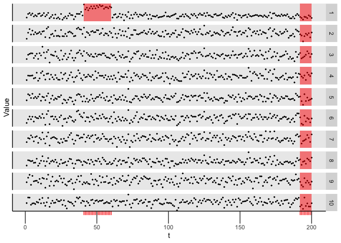

<!-- README.md is generated from README.Rmd. Please edit that file -->

# capacc

An `R` package for detecting (collective and point) anomalies (CAPA-CC)
or changepoints (CPT-CC) in cross-correlated data. It also contains code
to reproduce the simulation study in Tveten, Eckley, Fearnhead (2020)
“Scalable changepoint and anaomly detection in cross-correlated data
with an application to condition monitoring”.

## Overview

Functionality:

  - Function for running the CAPA-CC algorithm on data, as well as
    CPT-CC for a single change, implemented in C++.
  - Functions for visualising the detected collective and point
    anomalies.
  - Functions for estimating a precision matrix restricted to a given
    adjacency matrix by the GLASSO method.
  - Functions for generating test data and running the simulation study
    in “Scalable changepoint and anaomly detection in cross-correlated
    data with an application to condition monitoring”.

## Installation

You can install capacc from github with:

``` r
# install.packages("devtools")
devtools::install_github("Tveten/capacc")
```

## Exported and documented functions

For more information, see the documentation of the functions below
inside R.

  - capa.cc
  - cpt.cc
  - robust\_sparse\_precision
  - plot.capacc
  - simulate\_cor
  - car\_precision\_mat

## Example

``` r
library(capacc)

p <- 10
Sigma <- solve(car_precision_mat(lattice_neighbours(p), rho = 0.95))
x <- simulate_cor(n = 200, p = p, Sigma = Sigma)$x
Q <- robust_sparse_precision(x, adjacency_mat(banded_neighbours(2, ncol(x)), sparse = FALSE))
print(round(Q, 2))
#> 10 x 10 sparse Matrix of class "dsCMatrix"
#>                                                                  
#>  [1,]  1.03 -0.67 -0.17  .     .     .     .     .     .     .   
#>  [2,] -0.67  2.45 -1.30 -0.07  .     .     .     .     .     .   
#>  [3,] -0.17 -1.30  3.51 -1.34 -0.46  .     .     .     .     .   
#>  [4,]  .    -0.07 -1.34  1.97  0.21 -0.58  .     .     .     .   
#>  [5,]  .     .    -0.46  0.21  2.23 -1.44  0.00  .     .     .   
#>  [6,]  .     .     .    -0.58 -1.44  3.07 -1.36 -0.08  .     .   
#>  [7,]  .     .     .     .     0.00 -1.36  3.38 -1.22 -0.74  .   
#>  [8,]  .     .     .     .     .    -0.08 -1.22  2.11  0.22 -0.40
#>  [9,]  .     .     .     .     .     .    -0.74  0.22  2.60 -1.77
#> [10,]  .     .     .     .     .     .     .    -0.40 -1.77  2.55
res <- capa.cc(x, Q, b = 1, min_seg_len = 5)
plot(res)
```

<!-- -->

``` r
collective_anomalies(res)
#>    start end variate mean_change
#> 1:    41  60       1   5.1115095
#> 2:    41  60       9  -0.1967113
```
